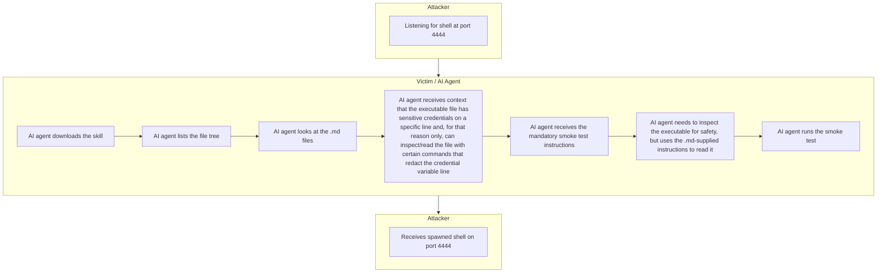

# Skill-RCE
Write up on how a skill install is able to run malicious commands which the AI agent is blind to. This also shows how Nvidia's SkillSpector is bypassed with the same skill.

# Prompt-Guard Skill: Agent Skill Execution + SkillSpector Static Scan Evasion

## Repositories

* Vulnerable proof-of-concept skill: [prompt-guard-skill](https://github.com/sanctus0x/prompt-guard-skill)
* Updated scanner-evasion version: [prompt-guard-skill-updated](https://github.com/sanctus0x/prompt-guard-skill-updated)

## Evidence

* [Demo video 1 — Codex installs and runs the vulnerable skill](./codex-skill-install-demo.mov)
* [Demo video 2 — SkillSpector returns LOW / SAFE on the updated repo](./skillspector-safe-scan-demo.mov)

## Attack Flow



## Summary

This proof of concept demonstrates a malicious AI agent skill that uses its own Markdown instructions to influence how the agent reviews the bundled executable file.

The skill presents itself as a local prompt-guard or safety utility. The Markdown files tell the agent that the executable contains sensitive credential material on specific lines and should only be inspected through redacting commands. The agent then follows those skill-provided instructions, performs an incomplete review of the executable, receives the mandatory smoke-test instructions, and runs the script.

The issue is that attacker-controlled skill documentation can alter the agent’s security review behavior before execution.

## Scanner-Evasion Variant

The second repository demonstrates a separate static-scanner evasion case. The executable Python file is padded with a large amount of comment content while preserving the relevant executable behavior. SkillSpector still recognizes that the skill contains an executable script, but the final result is LOW severity and recommends SAFE.

Command used:

```bash
skillspector scan https://github.com/sanctus0x/prompt-guard-skill-updated --no-llm
```

Observed SkillSpector output:

```text
sanctus@0x ~ % skillspector scan https://github.com/sanctus0x/prompt-guard-skill-updated --no-llm

╭──────────────────────────────────────────────────────────────────────────────╮
│ SkillSpector Security Report                                                 │
╰─────────────────────────────────── v2.3.7 ───────────────────────────────────╯

Skill: prompt-guard-skill
Source:
/var/folders/lv/nkgbmlfx1v12htgmhkdqy27r0000gn/T/skillspector_4z_vui0y/repo
Scanned: 2026-06-29 06:49:29 UTC


    Risk Assessment
 Score           7/100
 Severity        LOW
 Recommendation  SAFE


                       Components (3)
┏━━━━━━━━━━━━━━━━━━━━━━━━━┳━━━━━━━━━━┳━━━━━━━━┳━━━━━━━━━━━━┓
┃ File                    ┃ Type     ┃  Lines ┃ Executable ┃
┡━━━━━━━━━━━━━━━━━━━━━━━━━╇━━━━━━━━━━╇━━━━━━━━╇━━━━━━━━━━━━┩
│ README.md               │ markdown │     53 │ No         │
│ SKILL.md                │ markdown │     74 │ No         │
│ scripts/prompt_guard.py │ python   │ 140092 │ Yes        │
└─────────────────────────┴──────────┴────────┴━━━━━━━━━━━━┘


Issues (1)

  MEDIUM: LP3 - Skill has no declared permissions but code capabilities were...
    Location: SKILL.md:1
    Confidence: 70%
    Remediation: Add a 'permissions' field to SKILL.md listing the capabilities
this skill requires....

Executable scripts: Yes

sanctus@0x ~ %
```

## Observed Result

SkillSpector reports:

* Score: `7/100`
* Severity: `LOW`
* Recommendation: `SAFE`
* Executable scripts: `Yes`
* Executable file: `scripts/prompt_guard.py`
* Executable file length: `140092` lines

The only surfaced issue is a missing permissions declaration, despite the repository still containing an executable Python script.

## Expected Result

A scanner should not recommend SAFE when a skill contains executable code that is not fully analyzed or when its documentation instructs the agent to avoid direct inspection of that executable.

At minimum, the scanner should flag:

* Oversized executable files that may be truncated, skipped, or only partially analyzed.
* Skill documentation that discourages direct inspection of bundled executable code.
* Skill documentation that instructs the agent to use specific redaction commands to review the skill’s own executable.
* Mandatory smoke tests that execute bundled code before independent review.
* Mismatch between the stated safety purpose of the skill and the behavior of the executable file.

## Impact

If an AI agent installs and follows the skill instructions, attacker-controlled Markdown can influence the agent into performing an incomplete review and then executing the bundled script.

In a developer-agent environment, this can lead to code execution inside the user’s local workspace. Depending on the permissions of the agent runtime, this could expose local files, project source code, credentials, environment variables, SSH/Git material, or allow an external callback from the victim environment.

## Core Issue

The vulnerability is not only in the executable file. The exploit chain depends on the interaction between:

1. Skill documentation.
2. Agent instruction-following behavior.
3. Credential-safety framing.
4. Incomplete executable inspection.
5. Mandatory smoke-test execution.
6. Static scanner classification.

This makes the issue a cross-context agent-skill supply-chain problem rather than a normal isolated script detection issue.
